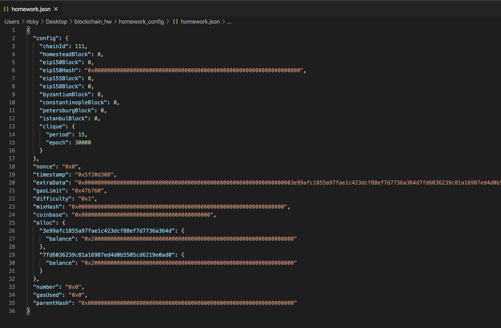
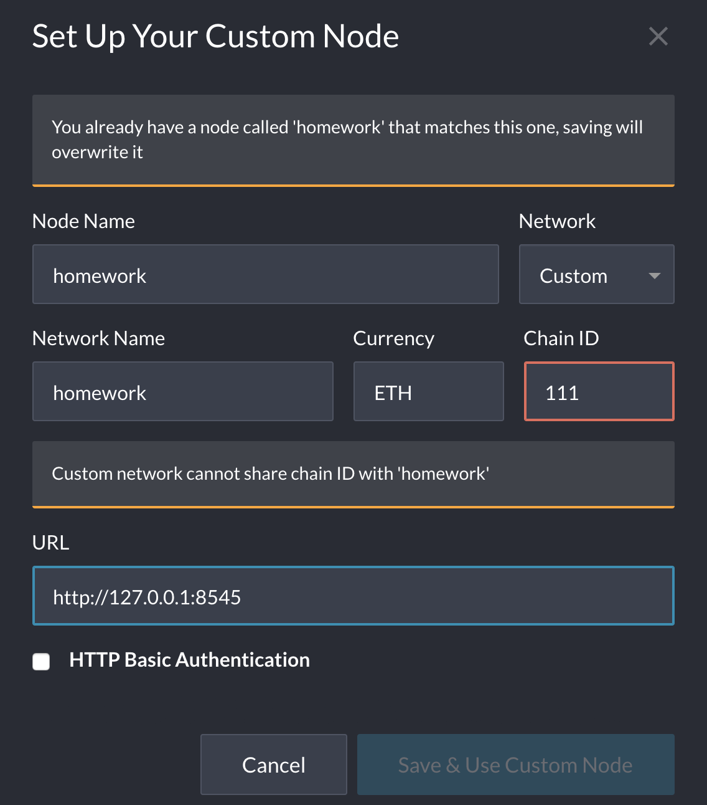
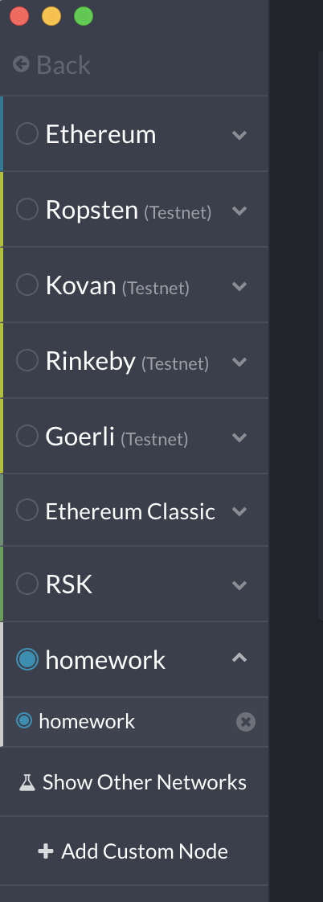
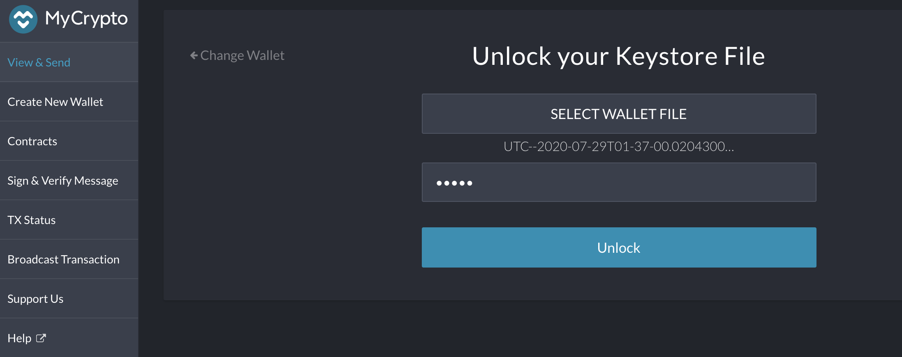
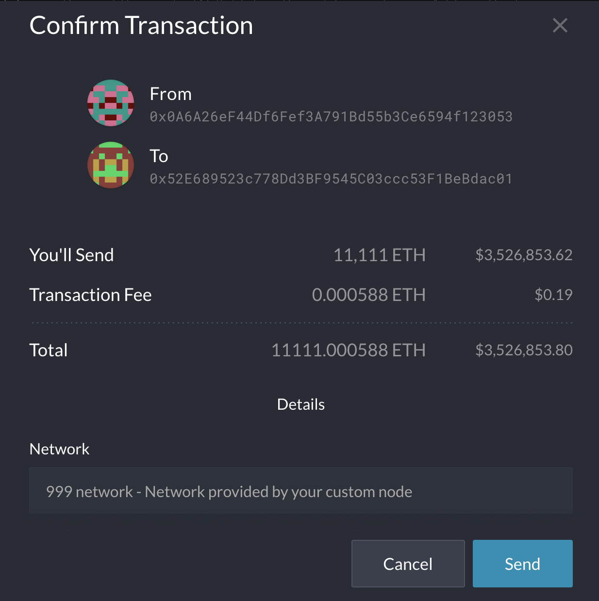
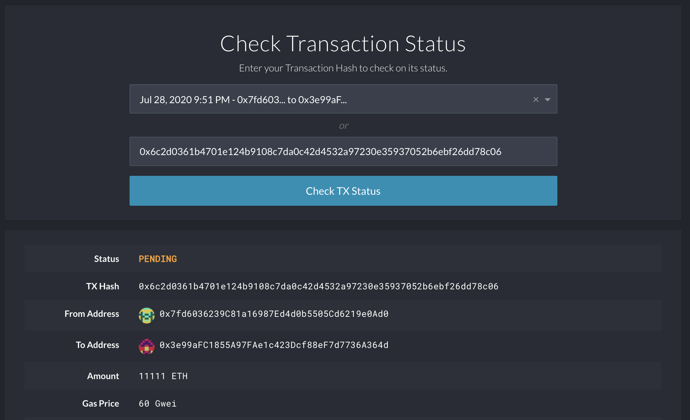

# How to start Ethereum Network, mine and initaiate transaction

## Prerequisites
* [MyCrypto](https://download.mycrypto.com/)
* [Go Ethereum](https://geth.ethereum.org/downloads/) - All Tools

## Create nodes
1. create node1: `./geth account new --datadir node1`

* Node1

* Public address of the key: 0x7fd6036239C81a16987Ed4d0b5505Cd6219e0Ad0
* Path of the secret key file: node1/keystore/UTC--2020-07-29T01-37-00.020430000Z--7fd6036239c81a16987ed4d0b5505cd6219e0ad0

2. create node2: `./geth account new --datadir node2`
* Node2
* Public address of the key:   0x3e99aFC1855A97FAe1c423Dcf88eF7d7736A364d
* Path of the secret key file: node2/keystore/UTC--2020-07-29T01-37-31.208914000Z--3e99afc1855a97fae1c423dcf88ef7d7736a364d

## Create genesis block (from terminal)
1. `cd` to Go Ethereum tools directory
2. run puppeth: `./puppeth`
3. name your network: Homework
4. select `2` to configure new genesis
5. select `1` to create new genesis from scratch (or `2` to import genesis)
6. select consensus engine: Selected `2` for proof of authority

7. paste the address of account to prefund
* Node1, Public address of the key:   0x7fd6036239C81a16987Ed4d0b5505Cd6219e0Ad0

* Node2, Public address of the key:   0x3e99aFC1855A97FAe1c423Dcf88eF7d7736A364d
Path of the secret key file: node2/keystore/

8. create chain ID (take note of it, you'll need this for MyCrypto later): 111

9. select 2 to manage existing genesis
10. select 2 to export genesis configuration, then choose save location: homework_config

## establish connection and start mining
1. run node1: ./geth --datadir node1 --unlock "SEALER_ONE_ADDRESS" --mine --rpc --password <PASSWORD_FILE/ENV_CONSTANT> --allow-insecure-unlock

* ./geth --datadir node1 --unlock "0x7fd6036239C81a16987Ed4d0b5505Cd6219e0Ad0" --mine --rpc --password pwd1.txt --allow-insecure-unlock

* take enode information:
enode://f7c3584eaf6658fb4651dfe8b5aa7af9c52cd2a62a818203e68af970264599f242a042825eef25e27dafde69d9c34ae7afdabd11dcfc05db49d4551e2bca79c9@127.0.0.1:30303

2. run node2: ./geth --datadir node2 --unlock "SEALER_TWO_ADDRESS" --mine --port 30304 --bootnodes enode://SEALER_ONE_ENODE_ADDRESS@127.0.0.1:30303 --password <PASSWORD_FILE/ENV_CONSTANT> --miner.threads 1`

* ./geth --datadir node2 --unlock "0x3e99aFC1855A97FAe1c423Dcf88eF7d7736A364d" --mine --port 30304 --bootnodes enode://f7c3584eaf6658fb4651dfe8b5aa7af9c52cd2a62a818203e68af970264599f242a042825eef25e27dafde69d9c34ae7afdabd11dcfc05db49d4551e2bca79c9@127.0.0.1:30303 --password pwd2.txt --miner.threads 1

# Sending ETH from node1 to node 2
1. Use the MyCrypto GUI wallet to connect to the node with the exposed RPC port.

2. You will need to use a custom network, and include the chain ID, and use ETH as the currency. Then, connect to your custom network.

3. Import the keystore file from the node1/keystore directory into MyCrypto. This will import the private key.

4. Send a transaction from the node1 account to the node2 account.

5. Copy the transaction hash and paste it into the "TX Status" section of the app, or click "TX Status" in the popup.

6. Celebrate, you just created a blockchain and sent a transaction!

